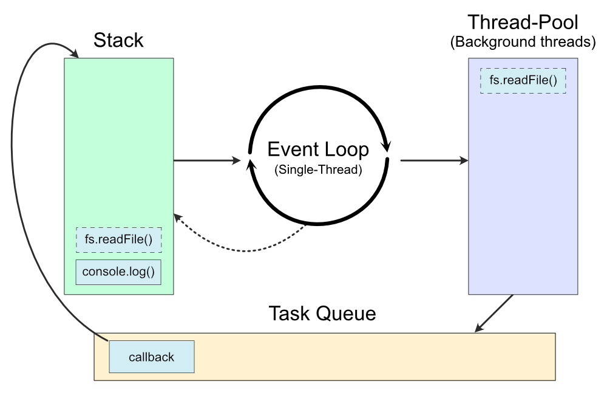
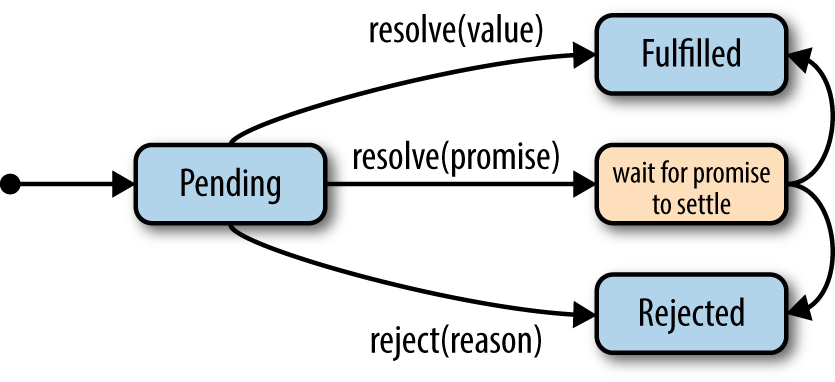

# Promises

Promise based code is tight with the more general **Event Driven** programming
model. A common form of programming when thinking in terms of User Interface.
There are numerous study and books about this programming paradigm, and this
programming paradigm is being around in the last 50 years, since the beginning
of first mouse pads. We will discuss promise based code from the server code
perspective, which have common points with User Interface, but also many
differences. We want to discuss the general approach, as well to get into some
code patterns illustrating with a concrete example so we could also show real
code examples.

# Events and the Event Loop

All idea is based on the concept that during a program execution a number of
**events** will occur and when it occur any **attached** function will be call.
This functions are called the **callback** function.

Based on this, the task is to create the callback that will attend to the event.
The most important entity in this programming model is the *Event Loop*. This
is represented in pseudo code:

```javascript

while(1) {
    if ( e = event.happened ) {
      for callback in e.callbacks { 
          callback(e)
      }
    }
}

```

That is, of course, not entire right, but is the simplest idea of events and
callbacks. Most of the time the event loop is implicit, and it is a backend
software wrote in C for efficiency, so it already exist from the beginning,
or after you call an initialization function.




The source of everything in an event loop are the events. They can be of many
types, but they are usually Input and Output in a data channel (A socket,
a file descriptor, a device).

# States of a promise

The following diagram extracted from @ParkerJavaScriptpromises2015 shows how
the state of a promise can change:



As we can see promises has three states:

1. *Pending* : It didn't begin or is in progress
2. *Fullfilled*: It completed successful
3. *Rejected*: It didn't completed, because of an error

# Coding with Promises

In Perl we can use the excellent module
[Mojo::Promise](https://metacpan.org/pod/Mojo::Promise). This module is based
on the so called [Promises/A+](https://promisesaplus.com) standard and is
really powerful and feature rich. In JavaScript promises are standard since
ES6 and can be use natively.

## Async Await Keywords

Since Promises help in order to write asynchronous code in an organized fashion,
avoiding the callback hell, (or callbacks that return callbacks). One further
step it to improve the promise model to make use of an operation that magically
solves the return value of a promise, without the need to use the *then/catch*
parts. In this manner making the code even easier to read and understand.

In Perl we can use the [Mojo::Base](https://metacpan.org/pod/Mojo::Base) module
to import these keywords. In Javascript ES6 version those are languages construct.


# An example

We can now take on a complete example on how promises could be used to solve
problems. We want to design a module that represents a user of a system. The
user profile is stored somewhere in other system, so the module must *retrieve*
data using some sort of method (HTTP request, database), but we want abstract
that and simple operates (at first) with a fake profile, but that would take
some amount (1~3 secs) of time to complete the operation.

```perl
package User;
{
    use Mojo::Base -base, -async_await, -signatures;
    use Mojo::Promise;
    use Data::Fake qw/Core Names Text Dates/;

    has _profile_p    => sub { undef };
    has _fake_profile => fake_hash(
        {
            name     => fake_name(),
            birthday => fake_past_datetime("%Y-%m-%d"),
            gender   => fake_pick(qw/Male Female Other/)
        }
    );

    sub get_profile_p ( $self ) {

        # simulate a first time promise that delays 1~3 secs to resolve/fail
        # and that fails 20% of times.
        $self->_profile_p(
            Mojo::Promise->new(
                sub ( $resolve, $reject ) {
                    if ( int rand 4 ) {
                        Mojo::IOLoop->timer(
                            int( rand(3) ) => sub {
                                $resolve->( $self->_fake_profile() );
                            }
                        );
                    } else {
                        $reject->('Fake error');
                    }
                }
            )
        ) unless $self->_profile_p;
        return $self->_profile_p;
    }

    1;
}
```


The code above create a package `User` that has the method `get_profile_p` that
returns a promise. We simulate that module to behave like a real service it
takes sometime to complete operation in this case *get the user profile*. This
means that we write this method to return not a value but a **promise**, where
the caller could later attach its callback to handle the value.

Let's check now how a user would make use of this module.

```perl
  use Mojo::Base -async_await;
  use Syntax::Keyword::Try;
  use User;

  my $user = User->new;

  async sub get_profile {
      my $user = shift;

      try { 
          my $p = await $user->get_profile_p;
          say $p->{name};
      }
      catch {
          die "Could not fetch user profile: $@";
      }
  }

  get_profile( $user )->wait;
```

The code shows the pattern of use, we have a `User` and we use an `async`
keyword to qualify the function `get_profile` that will query the user profile
and print his name, or that dies if cannot take the profile. Note that this
module is complete detached from a service, acting as a script.

Mojolicous is a web server framework. We can also, include it to show to the
web world our user data, and have an efficient non-blocking web application.

# Bibliography
